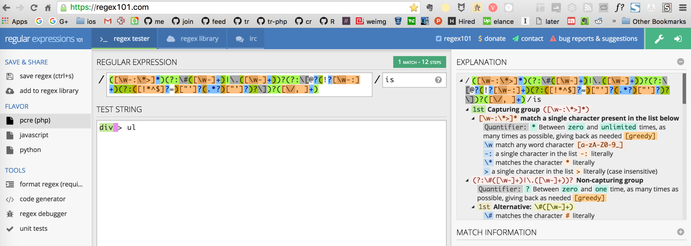
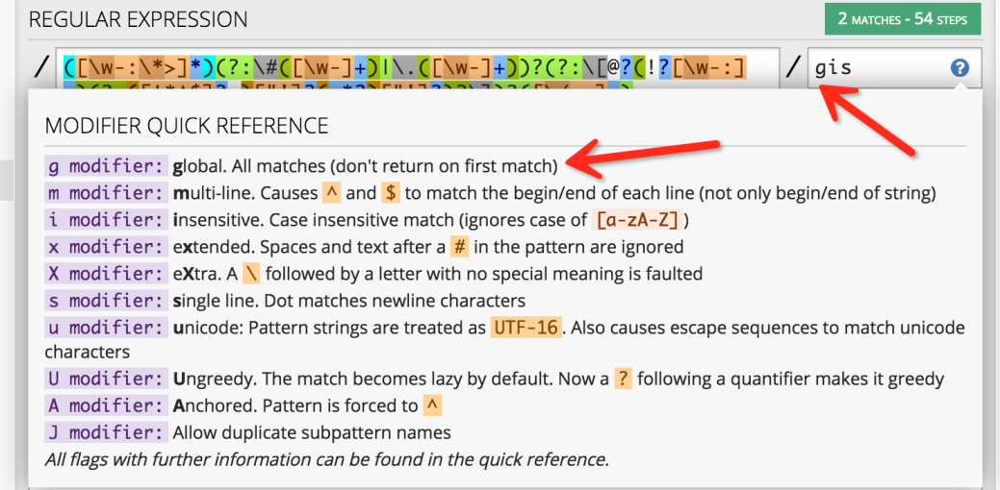
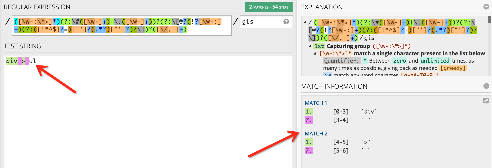
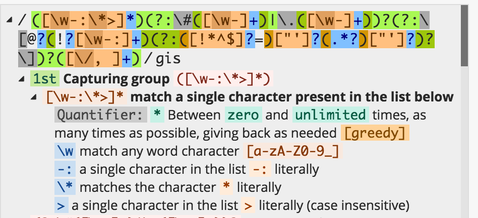
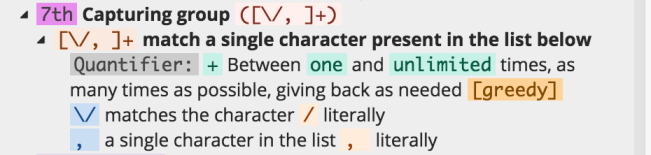
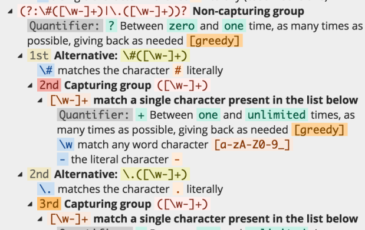

## 一则正则表达式分析

最近在研究 HTML 解析，遇到一个正则表达式：

`/([\w-:\*>]*)(?:\#([\w-]+)|\.([\w-]+))?(?:\[@?(!?[\w-:]+)(?:([!*^$]?=)["']?(.*?)["']?)?\])?([\/, ]+)/is`

它来匹配 CSS 选择器。

过去见过很多这样复杂的表达式，我都本能地退缩了，遇到问题没去搞明白。而直接去 StackOverflow 上再找一个。今天就来彻底搞明白它！男人，该对自己狠一点！

我找了一个网站 regex101.com ，能在线匹配，还有解释。



虽然有了右边的说明，清楚了一些。但还是不清楚具体匹配起来是怎样。那就找多几个例子，看例子来分析。

具体出现这个正则表达式的代码是：

```php
$matches = [];
preg_match_all($this->pattern, trim($selector).' ', $matches, PREG_SET_ORDER);
```

`preg_match_all` 的意思是来得到所有满足 pattern 的串。也即如果有

```php
preg_match_all("abc", "abcdabc", $matches)
```

第一个参数是 pattern，第二个参数是要匹配的字符串，第三个参数是结果引用。那么运行后， matches 数组里，会装着两个 abc。

有了这个理解之后，那么上图的`div > ul` 我们只匹配了前面四个字符`div >`。regex101 不支持preg_match_all ？还好找了下，加个叫 g 的修饰符就行了：



说是加了 g 的话，会去匹配所有，而不是匹配到第一个就早早返回了。

加了之后。我们匹配到了`div > `：



看右边。说第一个匹配中，即`div `，我们用第一个组的规则匹配的到`div`，然后用第7组的规则匹配的到了` `。

我们接着来看第一组规则的解释：



首先在这一大串表达式中。第一个括号括起来的我们叫第一组规则。这是一个 Capturing group。括号自身不来匹配，而是用来分组。[] 来表示一个集合，里面的规则来说明这是一个怎样的字符集合。这个字符集合里有：

* `\w` 就说大小写字母和 1 到 9 以及下划线都在这个字符集合里。
* `-:` 直接表示这两个字符在这个字符集合里。
* `\*` 则因为 `*` 在正则表达式中是保留字符，有它特殊的含义，所以要用 `\` 来 escape，来表示这是一个 `*` 字符，而没有特殊含义。
* `>` 则简单的表明 `>` 这个字符。

而 `[\w-:\*>]*`最后面的`*` 表示，前面的字符能出现 0 次或无数次，但要匹配尽可能多的次数。所以之所以能匹配`div`是因为，`\w` 匹配了`d`、`i`、`v`。之所以不再继续匹配后面的空格，是因为空格没有出现在`[]`中。那 capturing group 是什么意思呢？简单的，就是为了这组匹配能出现在结果 matches 数组中。还有相对应的 Non-capturing group，可以让一组匹配不出现在结果中。Non-capturing group 的语法是 (?:)。也即上面的`([\w-:\*>]*)`。 不需要这组结果的话，可以记为 `(?:[\w-:\*>]*)`

那问题来了，不出现在结果中，那不用括号不就行了？括号是为了分组，分组还是很有意义的。可以参考 [《What is a non capturing group? (?:) -StackOverflow》](http://stackoverflow.com/questions/3512471/what-is-a-non-capturing-group)。

接着讲完了`div` 满足第一组规则后，讲下` `为什么满足了第7组的规则。



很简单 `[\/, ]` 意思是说匹配这四个字符的任意一个字符，`+` 是说前面的匹配出现一次或无数次，次数要尽可能多。所以因为这四个字符有空格，就匹配了我们的空格。又因为`div `之后下一个的字符是`>`，所以不再满足第 7 组的规则，不继续匹配了。

嗯搞明白了 `div ` 的匹配。那为什么第 2 到 6 组的规则没有来去匹配这里面的空格呢，而把空格留给了第 7 组？

看看第二组的解释：



首先刚刚说过了`(?:)`来表示这是一个 Non-Capturing Group。最后面的`?`表示，前面的匹配可以出现0次或1次，但次数要尽可能多。所以就是说这组匹配可能根本没有。嗯把这些最外层的修复符去掉之后，就剩下了`\#([\w-]+)|\.([\w-]+)`，中间有个`|`，表示或的意思，满足两个匹配的其中一个即可。比如表达式`a|b`可以用来匹配`a`或`b`，但不能匹配`c`。先看前面一半，`\#([\w-]+)`，先是直接匹配的`#`字符。我们之前说的空格自然不是 # 字符，所以不满足这个匹配的，这个匹配的要求`#`字符后面跟着其它的字符。再看后一半，`\.([\w-]+)`，是`.`，也不满足。

可见 2 到 6 组都可能因为这样的原因，空格不是这些组要求的开头字符，所以不满足了，又因为这些组有个`？`修饰符，所以不满足也可以，因此跳到了第 7 组。


