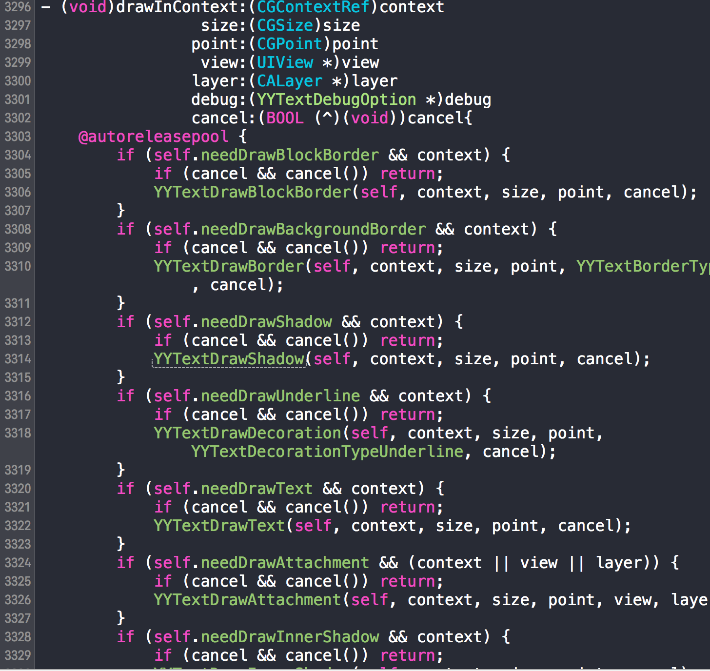
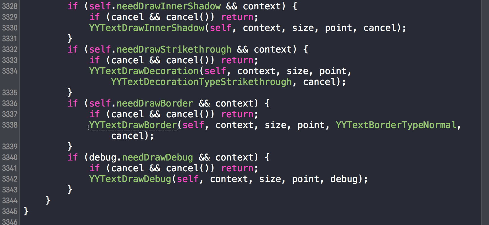
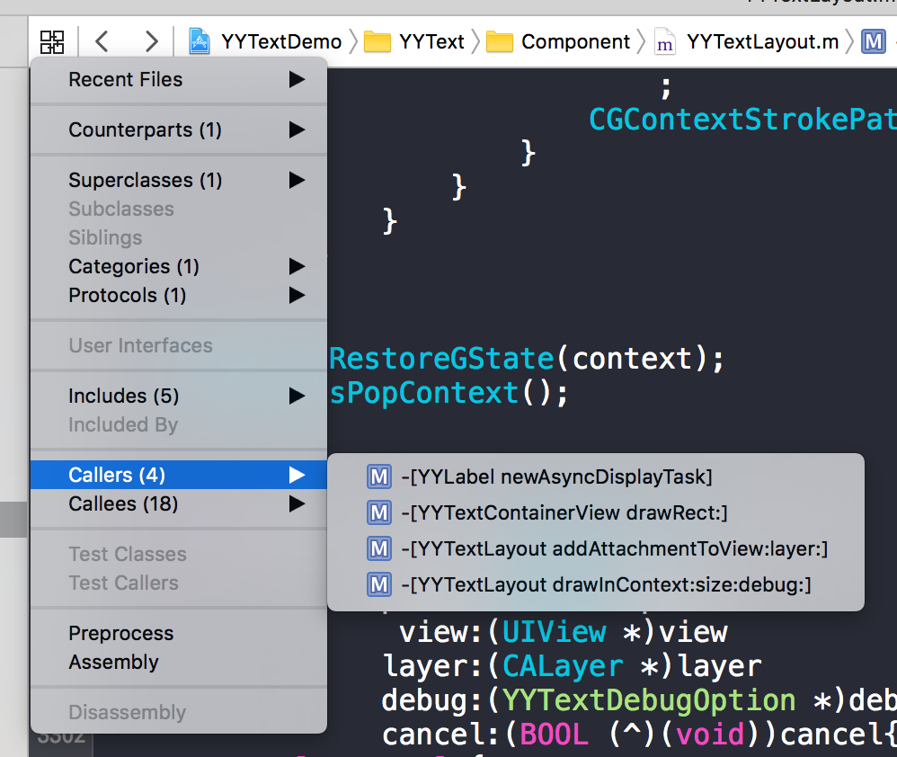
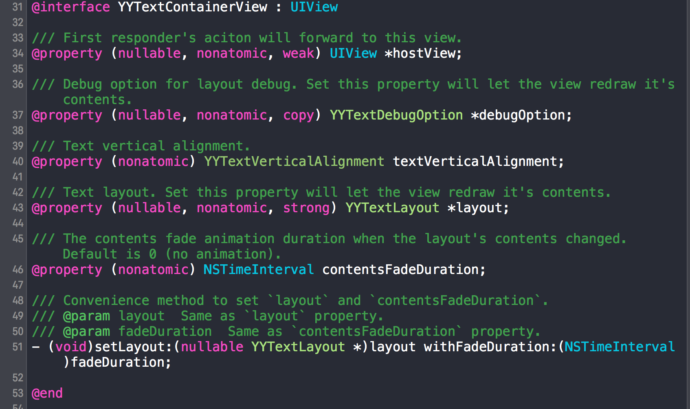
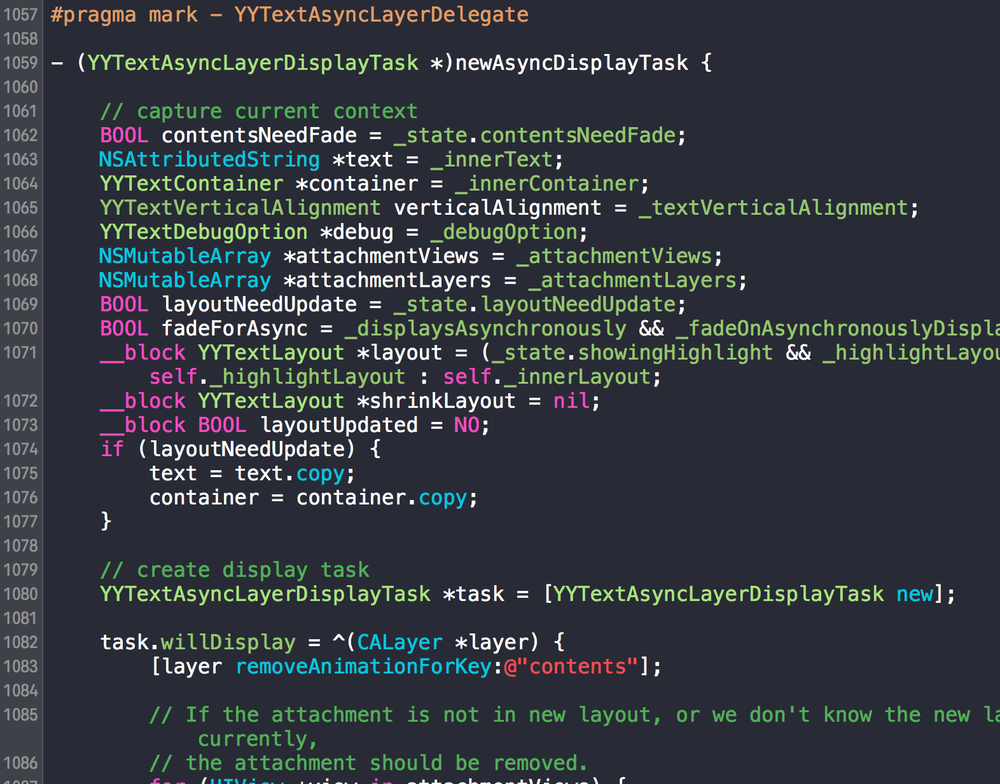
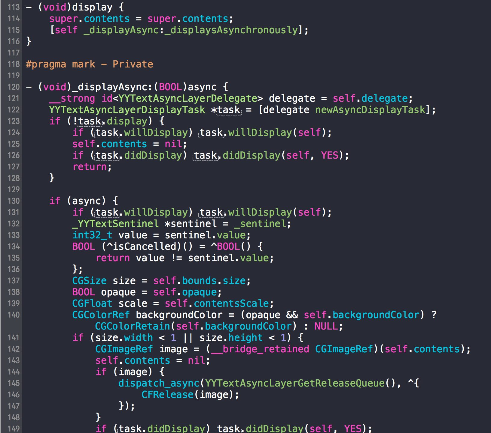

上面的阴影效果是用这样的代码实现的：

```objc
    NSMutableAttributedString *text = [NSMutableAttributedString new];
    
    {
        NSMutableAttributedString *one = [[NSMutableAttributedString alloc] initWithString:@"Shadow"];
        one.yy_font = [UIFont boldSystemFontOfSize:30];
        one.yy_color = [UIColor whiteColor];
        YYTextShadow *shadow = [YYTextShadow new];
        shadow.color = [UIColor colorWithWhite:0.000 alpha:0.490];
        shadow.offset = CGSizeMake(0, 1);
        shadow.radius = 5;
        one.yy_textShadow = shadow;
        [text appendAttributedString:one];
        [text appendAttributedString:[self padding]];
    }
        
    YYLabel *label = [YYLabel new];
    label.attributedText = text;
    label.width = self.view.width;
    label.height = self.view.height - (kiOS7Later ? 64 : 44);
    label.top = (kiOS7Later ? 64 : 0);
    label.textAlignment = NSTextAlignmentCenter;
    label.textVerticalAlignment = YYTextVerticalAlignmentCenter;
    label.numberOfLines = 0;
    label.backgroundColor = [UIColor colorWithWhite:0.933 alpha:1.000];
    [self.view addSubview:label];        
```

可以看到先生成了 YYTextShadow， 然后赋值给了 attributedString 的 yy_textShadow，然后再把 attributedString 赋值到 YYLabel 里面，接着把 YYLabel 加入到 UIView 里来显示。跟踪 yy_textshadow 发现，主要是把 textShadow 绑定到了 NSAttributedString 的 attribute 里，key 是 `YYTextShadowAttributeName`，值是 textShadow，也就是先把 shadow 存起来，后来再使用。

```objc
- (void)yy_setTextShadow:(YYTextShadow *)textShadow range:(NSRange)range {
    [self yy_setAttribute:YYTextShadowAttributeName value:textShadow range:range];
}

```

```objc
- (void)yy_setAttribute:(NSString *)name value:(id)value range:(NSRange)range {
    if (!name || [NSNull isEqual:name]) return;
    if (value && ![NSNull isEqual:value]) [self addAttribute:name value:value range:range];
    else [self removeAttribute:name range:range];
}
```

这里有个 addAttribute，它在 NSAttributedString.h 里

```objc
- (void)addAttribute:(NSString *)name value:(id)value range:(NSRange)range;
```

说你可以赋值任意的键值对给它。而 YYTextShadowAttributeName 的定义是：

```objc
NSString *const YYTextShadowAttributeName = @"YYTextShadow";
```

一个普通的字符串，说明先是把 shadow 信息存起来，然后后面再使用。我们全局搜索一下`YYTextShadowAttributeName `。

然后我们来到 YYTextLayout 里的 YYTextDrawShadow 函数，


`CGContextTranslateCTM` 是说改变一个 Context 里的原点坐标，所以

```objc
        CGContextTranslateCTM(context, point.x, point.y);
```

是说要把绘制的上下文移动到 point 点。我们还是先搞清楚哪里调用了 YYTextDrawShadow 吧，发现是在：





这里可看到，在 drawInContext 里，依次去绘制方块的边框，然后绘制背景边框、阴影、下划线、文字、附属物、内阴影、删除线、文字边框、调试线。

那到底那里用了上面的 drawInContext 呢？我们可以看到里面有个参数 YYTextDebugOption，所以这个函数一定不是系统的回调，而是 YYText 里面自己调用的。

我们按住 Ctrl + 1 弹出快捷键，发现有四个地方调用了它。



上面的 drawInContext:size:debug 可见还是 YYText 自己的调用，因为 debug 的类型是 `YYTextDebugOption *`， 是 YY 自身的，newAsyncTask 不像是系统的调用，addAttachmentToView:layer: 同理，所以极有可能是 drawRect:。


果然是，看右边的快速帮助，有详尽的解释，下面也说明了是在 UIView 里定义的。再看 YYTextContainerView，它是继承了 UIView 的。



所以 YYLabel 是用了 YYTextContainerView 咯？然后让系统调用 YYTextContainerView 里的 drawRect: 画出来？


奇怪，YYLabel 可继承了 UIView。所以，YYText 里应该有两套东西！一套 YYLabel，一套 YYTextView，像 UILabel 和 UITextView 一样。接着我们再回去看之前的 YYLabel 的 newAsyncDispalyTask，



很长，在中间的位置调用了 YYTextLayout 里的 drawInContext。newAsyncDispalyTask，它又是在哪里调用的呢？



在第二行被调用了。所以可以简单地理解为 YYLabel 用了异步来绘制文本。而 _displayAsync 被上面的 display 调用了。

